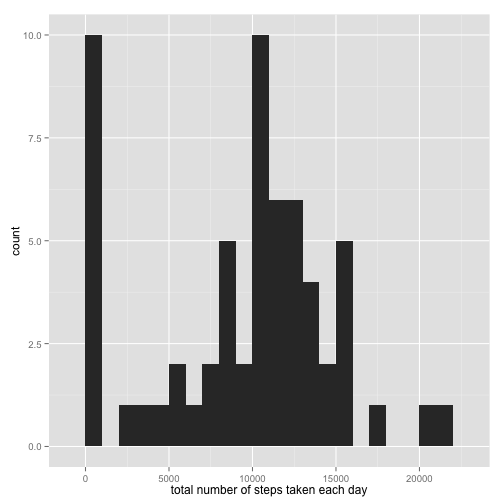
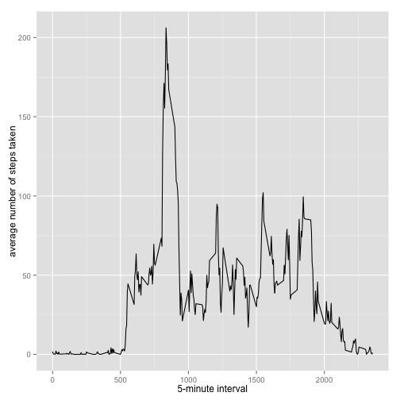
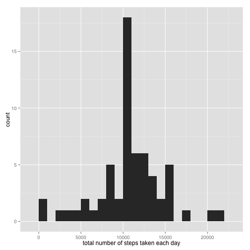
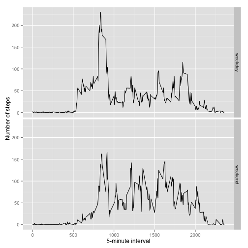

# Reproducible Research: Peer Assessment 1
# Dakota Carter


## Loading and preprocessing the data

```r
library(plyr)
library(ggplot2)
acdata <- read.csv("activity.csv")
```


## What is mean total number of steps taken per day?

```r
sumbydate <- tapply(acdata$steps, acdata$date, FUN = sum, na.rm = TRUE)
mean(sumbydate, na.rm = T)
```

```
## [1] 9354.23
```

```r
median(sumbydate, na.rm = T)
```

```
## [1] 10395
```

Here is the Histogram


```r
qplot(sumbydate, binwidth = 1000, xlab = "total number of steps taken each day")
```

 


## What is the highest average daily activity pattern?

```r
avgsteps <- aggregate(x = list(steps = acdata$steps), by = list(interval = acdata$interval), 
    FUN = mean, na.rm = TRUE)
avgsteps[which.max(avgsteps$steps), ]
```

```
##     interval    steps
## 104      835 206.1698
```

Here is the Plot

```r
ggplot(data = avgsteps, aes(x = interval, y = steps)) + geom_line() + xlab("5-minute interval") + 
    ylab("average number of steps taken")
```

 


## Imputing missing values
To replace the values the following code will replace any missing value with the mean value of that 5
minute interval across all the days with data for that interval. 

```r
missing <- sum(is.na(acdata))
missing
```

```
## [1] 2304
```
There are 2304 rows with missing values
Below I replace the missing values with the average value for that time interval.


```r
imputemean <- function(x) replace(x, is.na(x), mean(x, na.rm = T))
newacdata <- ddply(acdata, ~ interval, transform, steps = imputemean(steps))
newsumbydate <- tapply(newacdata$steps, newacdata$date, sum)
newsumby <- as.vector(newsumbydate)
```

Here is the Histogram with the replaced values

```r
qplot(newsumbydate, binwidth = 1000, xlab = "total number of steps taken each day")
```

 


```r
mean(newsumby)
```

```
## [1] 10766.19
```

```r
median(newsumby)
```

```
## [1] 10766.19
```

There is virtually no impact on either the mean or median by replacing the values. Of course
the frequency goes up for each number of steps so bars in the histogram grow taller, but there
is no change in the shape of the data. 


## Are there differences in activity patterns between weekdays and weekends?


```r
whichday <- function(date) {
        day <- weekdays(date)
        if (day %in% c("Monday", "Tuesday", "Wednesday", "Thursday", "Friday"))
                return("weekday") 
        else if (day %in% c("Saturday", "Sunday"))
                return("weekend")
        else stop("invalid date")
}
newacdata$date <- as.Date(newacdata$date)
newacdata$day <- sapply(newacdata$date, FUN = whichday)
avgsteps <- aggregate(steps ~ interval + day, data = newacdata, mean)
```

Here is the Panel Plot

```r
ggplot(avgsteps, aes(interval, steps)) + geom_line() + facet_grid(day ~ .) + 
    xlab("5-minute interval") + ylab("Number of steps")
```

 

The average weekend steps seem higher, especially late morning to evening. 
